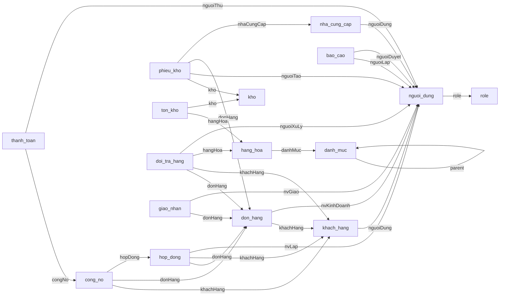

# Database MongoDB — Sài Gòn CMC

Database mặc định: **`vlxd_db`**. MongoDB dùng **collection** tương ứng với bảng và **document** tương ứng với dòng dữ liệu. Tài liệu này mô tả cấu trúc đang được source sử dụng, không phải bản thiết kế SQL cũ.

## File sử dụng

- [`Database.mongodb.js`](Database.mongodb.js): tạo collection và index bằng mongosh, chạy lại được; không xóa dữ liệu, không chèn tài khoản hay chứng từ.
- [`compose.yaml`](compose.yaml): chạy MongoDB replica set bằng Docker.
- `Database.sql`: lịch sử MySQL, không dùng cho ứng dụng hiện tại.

```powershell
mongosh "mongodb://localhost:27017/vlxd_db?replicaSet=rs0" --file Database.mongodb.js
```

Script dùng đúng database trong URI, không tự đổi database. Khởi động ứng dụng cũng tạo collection/index qua `MongoConfig`. Để có dữ liệu mẫu trên database demo mới, chạy ứng dụng với `SEED_DEMO=true` theo README.

## Quy ước lưu trữ

- `_id`: BSON int64 (`Long`); `version`: int64 phục vụ kiểm soát ghi đồng thời. Trường `id` trong Java ánh xạ thành `_id`, kể cả phần tử chi tiết nhúng.
- `BigDecimal`: BSON Decimal128; thời gian `LocalDate`/`LocalDateTime`: BSON Date qua bộ chuyển đổi của Spring Data. Ngày không kèm giờ vẫn lưu dạng Date.
- `@DocumentReference`: lưu ID của document đích, không nhúng cả đối tượng và không dùng DBRef. Các trường có hậu tố `Id` cũng là liên kết ID do nghiệp vụ kiểm tra.
- MongoDB không tự áp dụng khóa ngoại. Service kiểm tra tham chiếu, trạng thái và số dư; transaction cần replica set.
- Trường tùy chọn có thể vắng mặt. Script không áp validator bắt buộc khác với source hiện tại.
- Spring Data có thể lưu thêm `_class` để nhận diện kiểu Java. `passwordHash` là BCrypt, không phải mật khẩu rõ.

## Danh sách collection

| Collection | Model |
| --- | --- |
| `nguoi_dung` | [NguoiDung](ht_vlxd/src/main/java/com/example/ht_vlxd/Model/auth/NguoiDung.java) |
| `role` | [Role](ht_vlxd/src/main/java/com/example/ht_vlxd/Model/auth/Role.java) |
| `khach_hang` | [KhachHang](ht_vlxd/src/main/java/com/example/ht_vlxd/Model/customer/KhachHang.java) |
| `dinh_muc_vat_lieu` | [DinhMucVatLieu](ht_vlxd/src/main/java/com/example/ht_vlxd/Model/estimation/DinhMucVatLieu.java) |
| `cong_no` | [CongNo](ht_vlxd/src/main/java/com/example/ht_vlxd/Model/finance/CongNo.java) |
| `hoa_don` | [HoaDon](ht_vlxd/src/main/java/com/example/ht_vlxd/Model/finance/HoaDon.java) |
| `thanh_toan` | [ThanhToan](ht_vlxd/src/main/java/com/example/ht_vlxd/Model/finance/ThanhToan.java) |
| `kho` | [Kho](ht_vlxd/src/main/java/com/example/ht_vlxd/Model/inventory/Kho.java) |
| `lenh_xuat` | [LenhXuat](ht_vlxd/src/main/java/com/example/ht_vlxd/Model/inventory/LenhXuat.java) |
| `phieu_kho` | [PhieuKho](ht_vlxd/src/main/java/com/example/ht_vlxd/Model/inventory/PhieuKho.java) |
| `ton_kho` | [TonKho](ht_vlxd/src/main/java/com/example/ht_vlxd/Model/inventory/TonKho.java) |
| `bao_cao` | [BaoCao](ht_vlxd/src/main/java/com/example/ht_vlxd/Model/management/BaoCao.java) |
| `danh_muc` | [DanhMuc](ht_vlxd/src/main/java/com/example/ht_vlxd/Model/product/DanhMuc.java) |
| `de_xuat_danh_muc` | [DeXuatDanhMuc](ht_vlxd/src/main/java/com/example/ht_vlxd/Model/product/DeXuatDanhMuc.java) |
| `hang_hoa` | [HangHoa](ht_vlxd/src/main/java/com/example/ht_vlxd/Model/product/HangHoa.java) |
| `bang_bao_gia` | [BangBaoGia](ht_vlxd/src/main/java/com/example/ht_vlxd/Model/sales/BangBaoGia.java) |
| `doi_tra_hang` | [DoiTraHang](ht_vlxd/src/main/java/com/example/ht_vlxd/Model/sales/DoiTraHang.java) |
| `don_hang` | [DonHang](ht_vlxd/src/main/java/com/example/ht_vlxd/Model/sales/DonHang.java) |
| `giao_nhan` | [GiaoNhan](ht_vlxd/src/main/java/com/example/ht_vlxd/Model/sales/GiaoNhan.java) |
| `hop_dong` | [HopDong](ht_vlxd/src/main/java/com/example/ht_vlxd/Model/sales/HopDong.java) |
| `nha_cung_cap` | [NhaCungCap](ht_vlxd/src/main/java/com/example/ht_vlxd/Model/supplier/NhaCungCap.java) |
| `sequences` | Bộ đếm ID nguyên tử |

## Các trường dữ liệu

### `nguoi_dung`

Nguồn: [NguoiDung.java](ht_vlxd/src/main/java/com/example/ht_vlxd/Model/auth/NguoiDung.java)

| Trường BSON | Kiểu BSON | Liên kết / ý nghĩa lưu trữ |
| --- | --- | --- |
| `soLanDangNhapSai` | int32 | Giá trị do service lưu |
| `_id` | int64 | Khóa chính |
| `version` | int64 | Khóa phiên bản ghi |
| `username` | string | Giá trị do service lưu |
| `passwordHash` | string | BCrypt hash |
| `hoTen` | string | Giá trị do service lưu |
| `email` | string | Giá trị do service lưu |
| `soDienThoai` | string | Giá trị do service lưu |
| `diaChi` | string | Giá trị do service lưu |
| `avatarUrl` | string | Giá trị do service lưu |
| `role` | int64 | ID → `role` |
| `trangThai` | string | Giá trị do service lưu |
| `ngayTao` | date | Giá trị do service lưu |
| `ngayCapNhat` | date | Giá trị do service lưu |

### `role`

Nguồn: [Role.java](ht_vlxd/src/main/java/com/example/ht_vlxd/Model/auth/Role.java)

| Trường BSON | Kiểu BSON | Liên kết / ý nghĩa lưu trữ |
| --- | --- | --- |
| `_id` | int64 | Khóa chính |
| `version` | int64 | Khóa phiên bản ghi |
| `name` | string | Giá trị do service lưu |

### `khach_hang`

Nguồn: [KhachHang.java](ht_vlxd/src/main/java/com/example/ht_vlxd/Model/customer/KhachHang.java)

| Trường BSON | Kiểu BSON | Liên kết / ý nghĩa lưu trữ |
| --- | --- | --- |
| `_id` | int64 | Khóa chính |
| `version` | int64 | Khóa phiên bản ghi |
| `nguoiDung` | int64 | ID → `nguoi_dung` |
| `maKhachHang` | string | Giá trị do service lưu |
| `tenCongTy` | string | Giá trị do service lưu |
| `maSoThue` | string | Giá trị do service lưu |
| `nguoiDaiDien` | string | Giá trị do service lưu |
| `loaiKhach` | string | Giá trị do service lưu |
| `hanMucNo` | decimal128 | Giá trị do service lưu |
| `ghiChu` | string | Giá trị do service lưu |

### `dinh_muc_vat_lieu`

Nguồn: [DinhMucVatLieu.java](ht_vlxd/src/main/java/com/example/ht_vlxd/Model/estimation/DinhMucVatLieu.java)

| Trường BSON | Kiểu BSON | Liên kết / ý nghĩa lưu trữ |
| --- | --- | --- |
| `_id` | int64 | Khóa chính |
| `version` | int64 | Khóa phiên bản ghi |
| `loaiCongTrinh` | string | Giá trị do service lưu |
| `loaiVatLieu` | string | Giá trị do service lưu |
| `heSoM2` | decimal128 | Giá trị do service lưu |
| `donViTinh` | string | Giá trị do service lưu |
| `cachTinh` | string (enum) | Giá trị do service lưu |
| `kieuLamTron` | string (enum) | Giá trị do service lưu |
| `ghiChu` | string | Giá trị do service lưu |

### `cong_no`

Nguồn: [CongNo.java](ht_vlxd/src/main/java/com/example/ht_vlxd/Model/finance/CongNo.java)

| Trường BSON | Kiểu BSON | Liên kết / ý nghĩa lưu trữ |
| --- | --- | --- |
| `soTienDaHoan` | decimal128 | Giá trị do service lưu |
| `nhaCungCapId` | int64 | Giá trị do service lưu |
| `phieuNhapId` | int64 | Giá trị do service lưu |
| `loaiCongNo` | string | Giá trị do service lưu |
| `soTienHoanTra` | decimal128 | Giá trị do service lưu |
| `_id` | int64 | Khóa chính |
| `version` | int64 | Khóa phiên bản ghi |
| `khachHang` | int64 | ID → `khach_hang` |
| `donHang` | int64 | ID → `don_hang` |
| `hopDong` | int64 | ID → `hop_dong` |
| `soTienNo` | decimal128 | Giá trị do service lưu |
| `soTienDaTt` | decimal128 | Giá trị do service lưu |
| `ngayPhatSinh` | date | Giá trị do service lưu |
| `hanThanhToan` | date | Giá trị do service lưu |
| `trangThai` | string | Giá trị do service lưu |
| `ghiChu` | string | Giá trị do service lưu |

### `hoa_don`

Nguồn: [HoaDon.java](ht_vlxd/src/main/java/com/example/ht_vlxd/Model/finance/HoaDon.java)

| Trường BSON | Kiểu BSON | Liên kết / ý nghĩa lưu trữ |
| --- | --- | --- |
| `_id` | int64 | Khóa chính |
| `version` | int64 | Khóa phiên bản ghi |
| `maHoaDon` | string | Giá trị do service lưu |
| `hopDongId` | int64 | Giá trị do service lưu |
| `donHangId` | int64 | Giá trị do service lưu |
| `thanhToanId` | int64 | Giá trị do service lưu |
| `soTien` | decimal128 | Giá trị do service lưu |
| `ngayLap` | date | Giá trị do service lưu |
| `trangThai` | string | Giá trị do service lưu |

### `thanh_toan`

Nguồn: [ThanhToan.java](ht_vlxd/src/main/java/com/example/ht_vlxd/Model/finance/ThanhToan.java)

| Trường BSON | Kiểu BSON | Liên kết / ý nghĩa lưu trữ |
| --- | --- | --- |
| `loaiPhieu` | string | Giá trị do service lưu |
| `_id` | int64 | Khóa chính |
| `version` | int64 | Khóa phiên bản ghi |
| `maThanhToan` | string | Giá trị do service lưu |
| `congNo` | int64 | ID → `cong_no` |
| `nguoiThu` | int64 | ID → `nguoi_dung` |
| `soTien` | decimal128 | Giá trị do service lưu |
| `hinhThuc` | string | Giá trị do service lưu |
| `ngayThanhToan` | date | Giá trị do service lưu |
| `maGiaoDich` | string | Giá trị do service lưu |
| `ghiChu` | string | Giá trị do service lưu |

### `kho`

Nguồn: [Kho.java](ht_vlxd/src/main/java/com/example/ht_vlxd/Model/inventory/Kho.java)

| Trường BSON | Kiểu BSON | Liên kết / ý nghĩa lưu trữ |
| --- | --- | --- |
| `_id` | int64 | Khóa chính |
| `version` | int64 | Khóa phiên bản ghi |
| `maKho` | string | Giá trị do service lưu |
| `tenKho` | string | Giá trị do service lưu |
| `diaChi` | string | Giá trị do service lưu |
| `dienTich` | decimal128 | Giá trị do service lưu |
| `trangThai` | string | Giá trị do service lưu |

### `lenh_xuat`

Nguồn: [LenhXuat.java](ht_vlxd/src/main/java/com/example/ht_vlxd/Model/inventory/LenhXuat.java)

| Trường BSON | Kiểu BSON | Liên kết / ý nghĩa lưu trữ |
| --- | --- | --- |
| `_id` | int64 | Khóa chính |
| `version` | int64 | Khóa phiên bản ghi |
| `maLenhXuat` | string | Giá trị do service lưu |
| `donHangId` | int64 | Giá trị do service lưu |
| `hopDongId` | int64 | Giá trị do service lưu |
| `hoaDonId` | int64 | Giá trị do service lưu |
| `trangThai` | string | Giá trị do service lưu |
| `chiTiet` | array | Nhúng `DonHangChiTiet` |
| `ngayLap` | date | Giá trị do service lưu |

### `phieu_kho`

Nguồn: [PhieuKho.java](ht_vlxd/src/main/java/com/example/ht_vlxd/Model/inventory/PhieuKho.java)

| Trường BSON | Kiểu BSON | Liên kết / ý nghĩa lưu trữ |
| --- | --- | --- |
| `nguoiDuyetId` | int64 | Giá trị do service lưu |
| `ngayDuyet` | date | Giá trị do service lưu |
| `bienBanNhapHang` | string | Giá trị do service lưu |
| `tonKhoKiemKeId` | int64 | Giá trị do service lưu |
| `soLuongSoSach` | decimal128 | Giá trị do service lưu |
| `soLuongThucTe` | decimal128 | Giá trị do service lưu |
| `chiTiet` | array | Nhúng `PhieuKhoChiTiet` |
| `_id` | int64 | Khóa chính |
| `version` | int64 | Khóa phiên bản ghi |
| `maPhieu` | string | Giá trị do service lưu |
| `loaiPhieu` | string | Giá trị do service lưu |
| `kho` | int64 | ID → `kho` |
| `nguoiTao` | int64 | ID → `nguoi_dung` |
| `donHang` | int64 | ID → `don_hang` |
| `nhaCungCap` | int64 | ID → `nha_cung_cap` |
| `ngayLap` | date | Giá trị do service lưu |
| `ghiChu` | string | Giá trị do service lưu |
| `trangThai` | string | Giá trị do service lưu |

### PhieuKhoChiTiet — document nhúng

Nguồn: [PhieuKhoChiTiet.java](ht_vlxd/src/main/java/com/example/ht_vlxd/Model/inventory/PhieuKhoChiTiet.java)

| Trường BSON | Kiểu BSON | Liên kết / ý nghĩa lưu trữ |
| --- | --- | --- |
| `_id` | int64 | Khóa chính |
| `hangHoa` | int64 | ID → `hang_hoa` |
| `soLuong` | decimal128 | Giá trị do service lưu |
| `donGia` | decimal128 | Giá trị do service lưu |
| `ghiChu` | string | Giá trị do service lưu |

### `ton_kho`

Nguồn: [TonKho.java](ht_vlxd/src/main/java/com/example/ht_vlxd/Model/inventory/TonKho.java)

| Trường BSON | Kiểu BSON | Liên kết / ý nghĩa lưu trữ |
| --- | --- | --- |
| `_id` | int64 | Khóa chính |
| `version` | int64 | Khóa phiên bản ghi |
| `hangHoa` | int64 | ID → `hang_hoa` |
| `kho` | int64 | ID → `kho` |
| `soLuong` | decimal128 | Giá trị do service lưu |
| `ngayCapNhat` | date | Giá trị do service lưu |

### `bao_cao`

Nguồn: [BaoCao.java](ht_vlxd/src/main/java/com/example/ht_vlxd/Model/management/BaoCao.java)

| Trường BSON | Kiểu BSON | Liên kết / ý nghĩa lưu trữ |
| --- | --- | --- |
| `_id` | int64 | Khóa chính |
| `version` | int64 | Khóa phiên bản ghi |
| `loai` | string | Giá trị do service lưu |
| `tieuDe` | string | Giá trị do service lưu |
| `tuNgay` | date | Giá trị do service lưu |
| `denNgay` | date | Giá trị do service lưu |
| `nguoiLap` | int64 | ID → `nguoi_dung` |
| `ngayLap` | date | Giá trị do service lưu |
| `noiDungJson` | string | Giá trị do service lưu |
| `trangThai` | string | Giá trị do service lưu |
| `nguoiDuyet` | int64 | ID → `nguoi_dung` |
| `ngayDuyet` | date | Giá trị do service lưu |
| `ghiChu` | string | Giá trị do service lưu |

### `danh_muc`

Nguồn: [DanhMuc.java](ht_vlxd/src/main/java/com/example/ht_vlxd/Model/product/DanhMuc.java)

| Trường BSON | Kiểu BSON | Liên kết / ý nghĩa lưu trữ |
| --- | --- | --- |
| `hoatDong` | bool | Giá trị do service lưu |
| `_id` | int64 | Khóa chính |
| `version` | int64 | Khóa phiên bản ghi |
| `maDanhMuc` | string | Giá trị do service lưu |
| `ten` | string | Giá trị do service lưu |
| `moTa` | string | Giá trị do service lưu |
| `parent` | int64 | ID → `danh_muc` |

### `de_xuat_danh_muc`

Nguồn: [DeXuatDanhMuc.java](ht_vlxd/src/main/java/com/example/ht_vlxd/Model/product/DeXuatDanhMuc.java)

| Trường BSON | Kiểu BSON | Liên kết / ý nghĩa lưu trữ |
| --- | --- | --- |
| `_id` | int64 | Khóa chính |
| `version` | int64 | Khóa phiên bản ghi |
| `loai` | string | Giá trị do service lưu |
| `thaoTac` | string | Giá trị do service lưu |
| `hangHoa` | object | Nhúng bản sao `HangHoa` |
| `danhMuc` | object | Nhúng bản sao `DanhMuc` |
| `doiTuongId` | int64 | Giá trị do service lưu |
| `nguoiLapId` | int64 | Giá trị do service lưu |
| `nguoiDuyetId` | int64 | Giá trị do service lưu |
| `trangThai` | string | Giá trị do service lưu |
| `ngayLap` | date | Giá trị do service lưu |

### `hang_hoa`

Nguồn: [HangHoa.java](ht_vlxd/src/main/java/com/example/ht_vlxd/Model/product/HangHoa.java)

| Trường BSON | Kiểu BSON | Liên kết / ý nghĩa lưu trữ |
| --- | --- | --- |
| `_id` | int64 | Khóa chính |
| `version` | int64 | Khóa phiên bản ghi |
| `maHang` | string | Giá trị do service lưu |
| `tenHang` | string | Giá trị do service lưu |
| `danhMuc` | int64 | ID → `danh_muc` |
| `donViTinh` | string | Giá trị do service lưu |
| `quyCach` | string | Giá trị do service lưu |
| `giaBanLe` | decimal128 | Giá trị do service lưu |
| `giaBanSi` | decimal128 | Giá trị do service lưu |
| `trongLuongKg` | decimal128 | Giá trị do service lưu |
| `anhUrl` | string | Giá trị do service lưu |
| `trangThai` | string (enum) | Giá trị do service lưu |
| `ghiChu` | string | Giá trị do service lưu |
| `ngayTao` | date | Giá trị do service lưu |

### `bang_bao_gia`

Nguồn: [BangBaoGia.java](ht_vlxd/src/main/java/com/example/ht_vlxd/Model/sales/BangBaoGia.java)

| Trường BSON | Kiểu BSON | Liên kết / ý nghĩa lưu trữ |
| --- | --- | --- |
| `_id` | int64 | Khóa chính |
| `version` | int64 | Khóa phiên bản ghi |
| `maBaoGia` | string | Giá trị do service lưu |
| `khachHangId` | int64 | Giá trị do service lưu |
| `nguoiLapId` | int64 | Giá trị do service lưu |
| `chiTiet` | array | Nhúng `DonHangChiTiet` |
| `tongTien` | decimal128 | Giá trị do service lưu |
| `ngayLap` | date | Giá trị do service lưu |
| `hieuLucDen` | date | Giá trị do service lưu |
| `trangThai` | string | Giá trị do service lưu |

### `doi_tra_hang`

Nguồn: [DoiTraHang.java](ht_vlxd/src/main/java/com/example/ht_vlxd/Model/sales/DoiTraHang.java)

| Trường BSON | Kiểu BSON | Liên kết / ý nghĩa lưu trữ |
| --- | --- | --- |
| `phanLoai` | string | Giá trị do service lưu |
| `donGiaGoc` | decimal128 | Giá trị do service lưu |
| `khoNhanId` | int64 | Giá trị do service lưu |
| `_id` | int64 | Khóa chính |
| `version` | int64 | Khóa phiên bản ghi |
| `maDoiTra` | string | Giá trị do service lưu |
| `donHang` | int64 | ID → `don_hang` |
| `khachHang` | int64 | ID → `khach_hang` |
| `loai` | string | Giá trị do service lưu |
| `lyDo` | string | Giá trị do service lưu |
| `soLuong` | decimal128 | Giá trị do service lưu |
| `hangHoa` | int64 | ID → `hang_hoa` |
| `ngayYeuCau` | date | Giá trị do service lưu |
| `trangThai` | string | Giá trị do service lưu |
| `nguoiXuLy` | int64 | ID → `nguoi_dung` |
| `ghiChuXuLy` | string | Giá trị do service lưu |
| `ngayXuLy` | date | Giá trị do service lưu |

### `don_hang`

Nguồn: [DonHang.java](ht_vlxd/src/main/java/com/example/ht_vlxd/Model/sales/DonHang.java)

| Trường BSON | Kiểu BSON | Liên kết / ý nghĩa lưu trữ |
| --- | --- | --- |
| `doiTraId` | int64 | Giá trị do service lưu |
| `baoGiaId` | int64 | Giá trị do service lưu |
| `chiTiet` | array | Nhúng `DonHangChiTiet` |
| `_id` | int64 | Khóa chính |
| `version` | int64 | Khóa phiên bản ghi |
| `maDonHang` | string | Giá trị do service lưu |
| `khachHang` | int64 | ID → `khach_hang` |
| `tenKhachVangLai` | string | Giá trị do service lưu |
| `sdtKhachVangLai` | string | Giá trị do service lưu |
| `nvKinhDoanh` | int64 | ID → `nguoi_dung` |
| `ngayDat` | date | Giá trị do service lưu |
| `ngayGiaoDuKien` | date | Giá trị do service lưu |
| `diaChiGiao` | string | Giá trị do service lưu |
| `tongTien` | decimal128 | Giá trị do service lưu |
| `tienDatCoc` | decimal128 | Giá trị do service lưu |
| `trangThai` | string | Giá trị do service lưu |
| `ghiChu` | string | Giá trị do service lưu |
| `ngayCapNhat` | date | Giá trị do service lưu |

### DonHangChiTiet — document nhúng

Nguồn: [DonHangChiTiet.java](ht_vlxd/src/main/java/com/example/ht_vlxd/Model/sales/DonHangChiTiet.java)

| Trường BSON | Kiểu BSON | Liên kết / ý nghĩa lưu trữ |
| --- | --- | --- |
| `_id` | int64 | Khóa chính |
| `hangHoa` | int64 | ID → `hang_hoa` |
| `soLuong` | decimal128 | Giá trị do service lưu |
| `donGia` | decimal128 | Giá trị do service lưu |
| `thanhTien` | decimal128 | Giá trị do service lưu |
| `ghiChu` | string | Giá trị do service lưu |

### `giao_nhan`

Nguồn: [GiaoNhan.java](ht_vlxd/src/main/java/com/example/ht_vlxd/Model/sales/GiaoNhan.java)

| Trường BSON | Kiểu BSON | Liên kết / ý nghĩa lưu trữ |
| --- | --- | --- |
| `bienBanBanGiao` | string | Giá trị do service lưu |
| `bienBanSuVu` | array | Mảng `String` |
| `_id` | int64 | Khóa chính |
| `version` | int64 | Khóa phiên bản ghi |
| `maGiaoNhan` | string | Giá trị do service lưu |
| `donHang` | int64 | ID → `don_hang` |
| `nvGiao` | int64 | ID → `nguoi_dung` |
| `ngayGiaoDuKien` | date | Giá trị do service lưu |
| `ngayGiaoThuc` | date | Giá trị do service lưu |
| `diaChiGiao` | string | Giá trị do service lưu |
| `loTrinh` | string | Giá trị do service lưu |
| `trangThai` | string | Giá trị do service lưu |
| `ghiChuGiao` | string | Giá trị do service lưu |
| `nguoiNhan` | string | Giá trị do service lưu |
| `soDienThoaiNhan` | string | Giá trị do service lưu |
| `daBanGiao` | bool | Giá trị do service lưu |
| `ngayBanGiao` | date | Giá trị do service lưu |

### `hop_dong`

Nguồn: [HopDong.java](ht_vlxd/src/main/java/com/example/ht_vlxd/Model/sales/HopDong.java)

| Trường BSON | Kiểu BSON | Liên kết / ý nghĩa lưu trữ |
| --- | --- | --- |
| `nguoiDuyetId` | int64 | Giá trị do service lưu |
| `ngayDuyet` | date | Giá trị do service lưu |
| `chiTiet` | array | Nhúng `DonHangChiTiet` |
| `tienDaThu` | decimal128 | Giá trị do service lưu |
| `_id` | int64 | Khóa chính |
| `version` | int64 | Khóa phiên bản ghi |
| `maHopDong` | string | Giá trị do service lưu |
| `donHang` | int64 | ID → `don_hang` |
| `khachHang` | int64 | ID → `khach_hang` |
| `nvLap` | int64 | ID → `nguoi_dung` |
| `ngayKy` | date | Giá trị do service lưu |
| `ngayHieuLuc` | date | Giá trị do service lưu |
| `ngayHetHan` | date | Giá trị do service lưu |
| `giaTri` | decimal128 | Giá trị do service lưu |
| `tienDatCoc` | decimal128 | Giá trị do service lưu |
| `dieuKhoanTt` | string | Giá trị do service lưu |
| `noiDung` | string | Giá trị do service lưu |
| `trangThai` | string | Giá trị do service lưu |
| `fileUrl` | string | Giá trị do service lưu |
| `ngayTao` | date | Giá trị do service lưu |

### `nha_cung_cap`

Nguồn: [NhaCungCap.java](ht_vlxd/src/main/java/com/example/ht_vlxd/Model/supplier/NhaCungCap.java)

| Trường BSON | Kiểu BSON | Liên kết / ý nghĩa lưu trữ |
| --- | --- | --- |
| `_id` | int64 | Khóa chính |
| `version` | int64 | Khóa phiên bản ghi |
| `nguoiDung` | int64 | ID → `nguoi_dung` |
| `maNcc` | string | Giá trị do service lưu |
| `tenNcc` | string | Giá trị do service lưu |
| `maSoThue` | string | Giá trị do service lưu |
| `diaChi` | string | Giá trị do service lưu |
| `email` | string | Giá trị do service lưu |
| `soDienThoai` | string | Giá trị do service lưu |
| `nguoiLienHe` | string | Giá trị do service lưu |
| `trangThai` | string | Giá trị do service lưu |
| `ghiChu` | string | Giá trị do service lưu |
| `ngayTao` | date | Giá trị do service lưu |

### `sequences`

| Trường | Kiểu | Ý nghĩa |
| --- | --- | --- |
| `_id` | string | Tên collection được cấp ID |
| `value` | int64 | ID cuối được cấp bởi thao tác `$inc` nguyên tử |

Không đặt lại bộ đếm của database đã có dữ liệu. Công cụ chuyển dữ liệu cũ tạo giá trị bộ đếm từ ID lớn nhất.

## Index

Mỗi collection có index unique `_id_` mặc định. Các index bổ sung dưới đây khớp annotation của model và `MongoConfig`; snapshot trong `de_xuat_danh_muc` không kế thừa unique index của danh mục/hàng hóa.

| Collection | Khóa | Tên | Unique | Sparse |
| --- | --- | --- | --- | --- |
| `nguoi_dung` | `{"username": 1}` | `username` | Có | Có |
| `nguoi_dung` | `{"email": 1}` | `email` | Có | Có |
| `role` | `{"name": 1}` | `name` | Có | Có |
| `khach_hang` | `{"maKhachHang": 1}` | `maKhachHang` | Có | Có |
| `dinh_muc_vat_lieu` | `{"loaiCongTrinh": 1, "loaiVatLieu": 1}` | `DinhMucVatLieu_unique` | Có | Không |
| `cong_no` | `{"phieuNhapId": 1}` | `phieuNhapId` | Có | Có |
| `cong_no` | `{"donHang": 1}` | `donHang` | Có | Có |
| `hoa_don` | `{"maHoaDon": 1}` | `maHoaDon` | Có | Không |
| `hoa_don` | `{"thanhToanId": 1}` | `thanhToanId` | Có | Không |
| `thanh_toan` | `{"maThanhToan": 1}` | `maThanhToan` | Có | Có |
| `thanh_toan` | `{"maGiaoDich": 1}` | `maGiaoDich` | Có | Có |
| `kho` | `{"maKho": 1}` | `maKho` | Có | Có |
| `lenh_xuat` | `{"maLenhXuat": 1}` | `maLenhXuat` | Có | Không |
| `lenh_xuat` | `{"donHangId": 1}` | `donHangId` | Có | Không |
| `phieu_kho` | `{"maPhieu": 1}` | `maPhieu` | Có | Có |
| `ton_kho` | `{"hangHoa": 1, "kho": 1}` | `TonKho_unique` | Có | Không |
| `danh_muc` | `{"maDanhMuc": 1}` | `maDanhMuc` | Có | Có |
| `hang_hoa` | `{"maHang": 1}` | `maHang` | Có | Có |
| `bang_bao_gia` | `{"maBaoGia": 1}` | `maBaoGia` | Có | Không |
| `doi_tra_hang` | `{"maDoiTra": 1}` | `maDoiTra` | Có | Có |
| `don_hang` | `{"maDonHang": 1}` | `maDonHang` | Có | Có |
| `giao_nhan` | `{"maGiaoNhan": 1}` | `maGiaoNhan` | Có | Có |
| `hop_dong` | `{"maHopDong": 1}` | `maHopDong` | Có | Có |
| `nha_cung_cap` | `{"maNcc": 1}` | `maNcc` | Có | Có |

## Sơ đồ tham chiếu

Mũi tên dưới đây là trường `@DocumentReference`; đây là liên kết logic, không phải ràng buộc khóa ngoại của MongoDB.



## Chi tiết nhúng và liên kết ID

- `don_hang.chiTiet`, `hop_dong.chiTiet`, `bang_bao_gia.chiTiet`, `lenh_xuat.chiTiet`: mảng `DonHangChiTiet`. Không có collection `don_hang_chi_tiet`.
- `phieu_kho.chiTiet`: mảng `PhieuKhoChiTiet`. Không có collection `phieu_kho_chi_tiet`.
- Tham chiếu ngược `DonHangChiTiet.donHang` và `PhieuKhoChiTiet.phieuKho` là transient, không lưu vào MongoDB.
- `de_xuat_danh_muc.hangHoa` / `.danhMuc`: bản sao đề xuất nhúng, chỉ cập nhật danh mục chính sau khi được duyệt.
- Các trường `...Id` như `hoa_don.thanhToanId`, `lenh_xuat.donHangId`, `bang_bao_gia.khachHangId` lưu ID của chứng từ/đối tượng tương ứng; không dùng `@DocumentReference`.
- `de_xuat_danh_muc.doiTuongId` trỏ tới hàng hóa hoặc danh mục theo `loai`; `cong_no.phieuNhapId` trỏ tới phiếu nhập kho.

## Ví dụ document minh họa

Ví dụ chỉ mô tả kiểu lưu BSON, không phải dữ liệu thật hoặc lệnh seed. Các ID tham chiếu phải tồn tại khi tạo chứng từ qua ứng dụng.

```javascript
{
  _id: NumberLong("1"),
  version: NumberLong("0"),
  maDonHang: "DH-MINH-HOA",
  khachHang: NumberLong("1"),
  tongTien: NumberDecimal("200000"),
  tienDatCoc: NumberDecimal("0"),
  trangThai: "CHO_XAC_NHAN",
  chiTiet: [{
    hangHoa: NumberLong("1"),
    soLuong: NumberDecimal("2"),
    donGia: NumberDecimal("100000"),
    thanhTien: NumberDecimal("200000")
  }]
}
```

Giá và số lượng chứng từ được lưu tại thời điểm giao dịch; chỉnh giá hàng hóa không đổi giá chứng từ cũ. Thu/chi, duyệt xuất/nhập và đổi/trả đi qua service để đảm bảo công nợ và tồn kho nhất quán.
